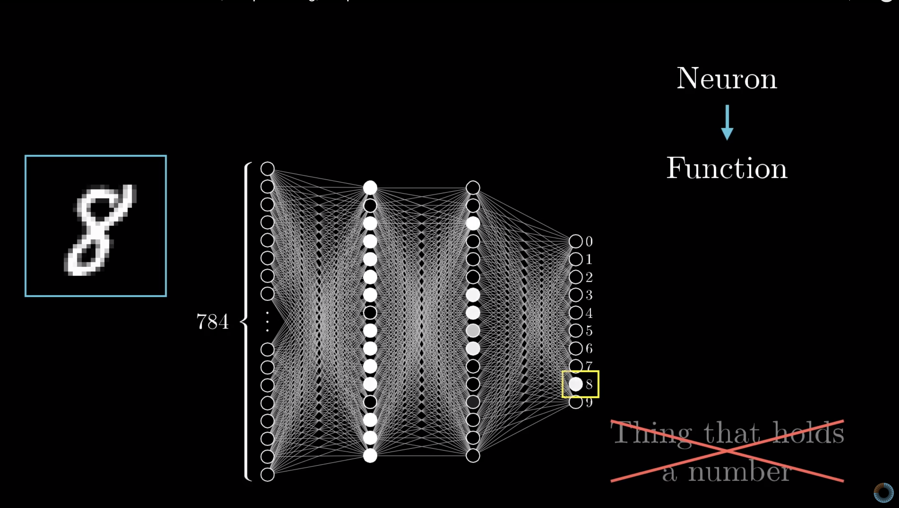

<!-- README.md is generated from README.Rmd. Please edit that file -->

```{r, echo = FALSE}
knitr::opts_chunk$set(
  collapse = TRUE,
  comment = "#>",
  fig.path = "README-"
)
```

# DivIII

The goal of my Div III is to build a robust neural network for video motion and image classification. I plan to divide my Div III into three stages. The first stage, learning the disadvantage and limitation of the current neural network. At the end of the first stage, I should be able to build a neural network to fool another neural network. The second stage, I will add attention as a feature to the neural network for image classification and test the improvement compared to a traditional neural network. The third stage, if everything goes well, I will adapt the attention technique into a video motion recognition to see if it's a better solution for video motion processing.


## Week Report

I am going to use Pkgdown to report my weekly progress. The deadline to update weekly report is every Saturday.

## Week 0 (and before)
(Unfortunatelly, the gif is not working, I am replacing all the gifs with png for now. But I found a package called mapmate which successfully put a gif alive in the pkgdown website.)

//TO DO fix the gif

### 3blue1brwon video
I am still looking for different papers that seems related to the field. Luckily, I found some interesting videos, some published code, and some papers.

I have to say that, from all the resources I have read so far, image:  the video from 3blue1brown gvies the best visual representation. It depicts what's the usage of different weight in a DNN model. Besides that, it melts some of the linear algebra knowledge, linear combination and Sigmoid function into graphics. Tough, it must simplify some details in DNN, and I still like the video, because it gave me a really general idea of how DNNs work.

The link is here: https://www.youtube.com/watch?v=aircAruvnKk&t=1014s

It also gives a great free online book that I may use as a reference in the future.
Link: Neural Networks and Deep Learning http://neuralnetworksanddeeplearning.com/index.html
A published code in Python which I went through to learn the numpy and theano package in python. https://github.com/mnielsen/neural-networks-and-deep-learning

Also found a relative link in the video: https://distill.pub/ The Attention and Augmented Recurrent Neural Networks

//TO DO go over this paper in distill.pub


### NeuralTalk and Walk

https://vimeo.com/146492001
Related to one of my background check paper, this video generating live caption via a webcam walking on the street. It looks fansicnating with such high accuracy! Luckily, the code is on the github. I will dig into this in my phase 3 of my DivIII.
https://github.com/karpathy/neuraltalk2


### Synthesizing Robust Adversarial Examples

 https://arxiv.org/pdf/1707.07397.pdf
 This paper gives a great example of how fragile most current DNNs are! They can be easily tricked based on the method described! 
 I will try to replicate the result in my phase 2.


